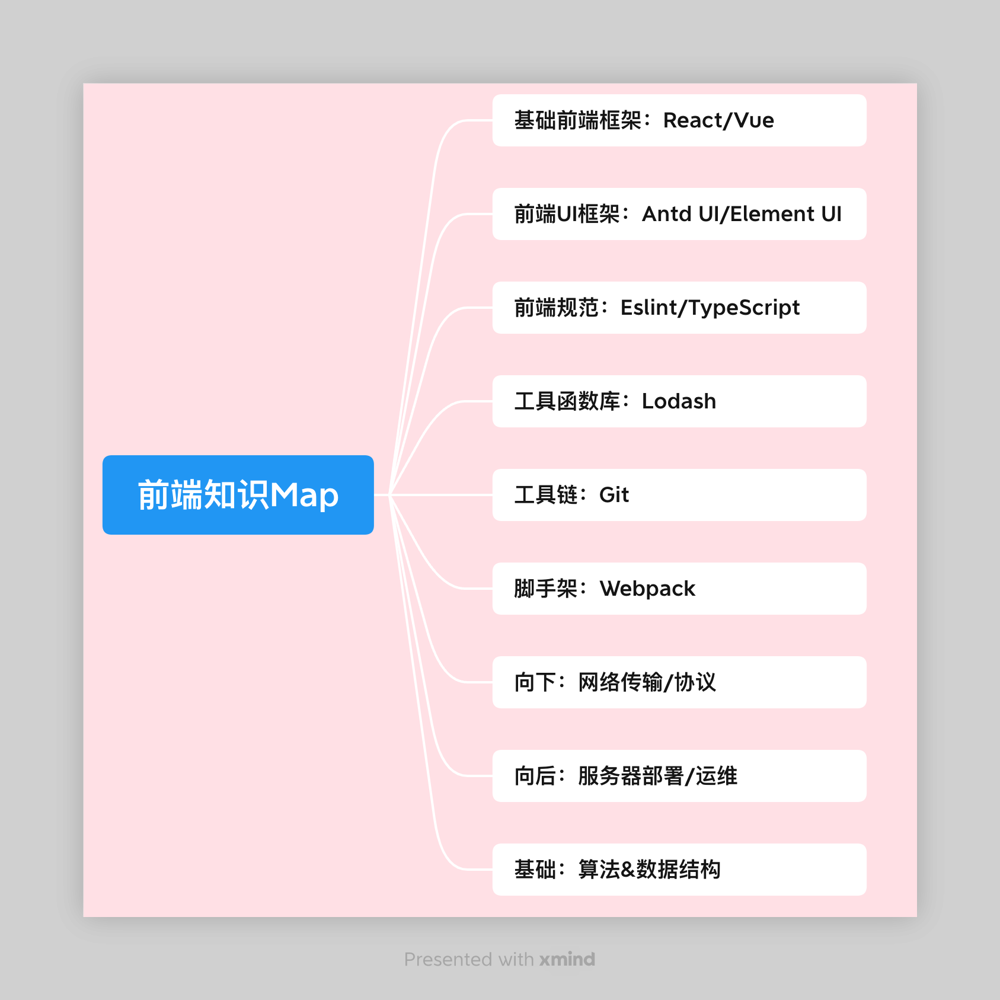

# 专题学习

## 1. 应用框架系列

## 2. 工具集合系列

## ---分界线--------------

## 1. 工程架构系列

## 2. 微前端系列集

## 3. 低代码系列集

## 4. 多端跨端系列

## 5. 服务器渲染集

## 6. 动效可视化集

## ---Map 图--------------

口诀：先骨架后细节，学习要见反馈

1. 基础前端框架 React、Vue
2. 前端 UI 框架 Antd UI、Element UI
3. 搭建项目的脚手架 Webpack
4. 工具函数 Lodash，很多好用的项目常见函数
5. 前端规范：EsLint、TypeScript
6. 向后：项目服务器部署，运维层面知识
7. 向下：网络传输、协议
8. 基础：算法&数据结构
9. 工具链：Git

